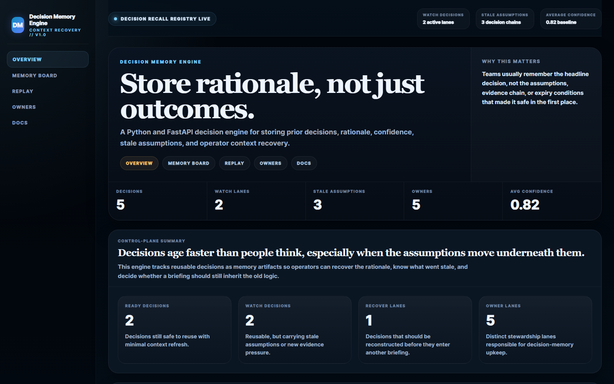
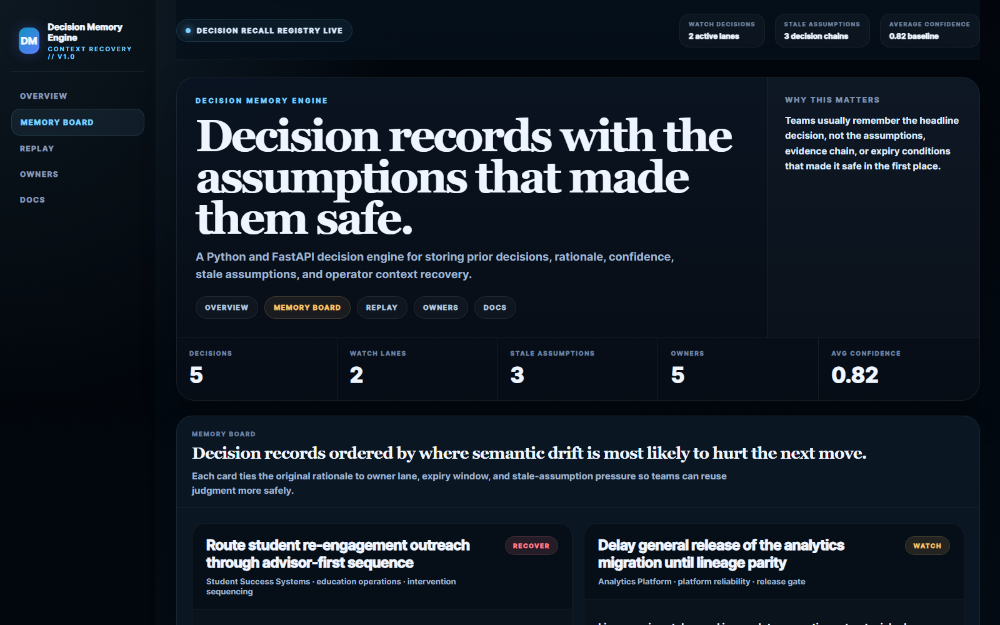
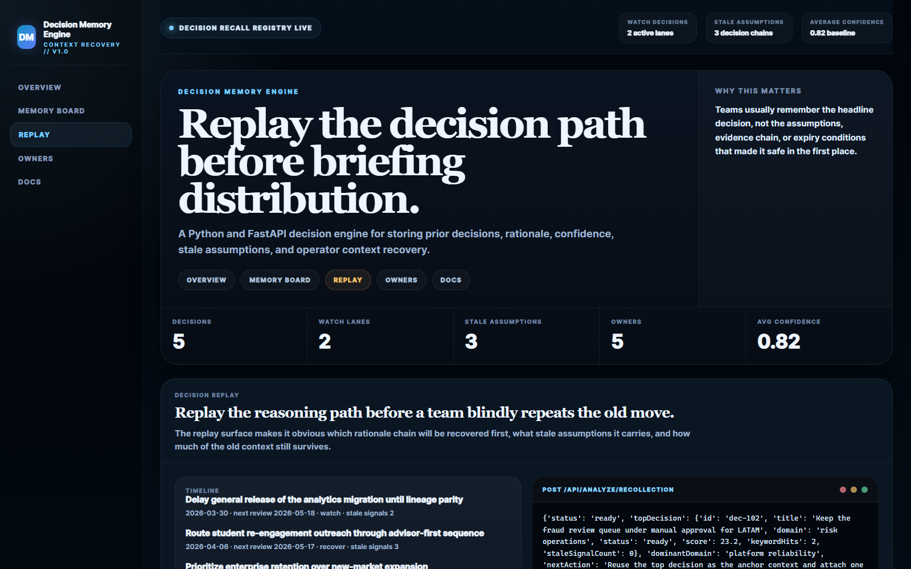
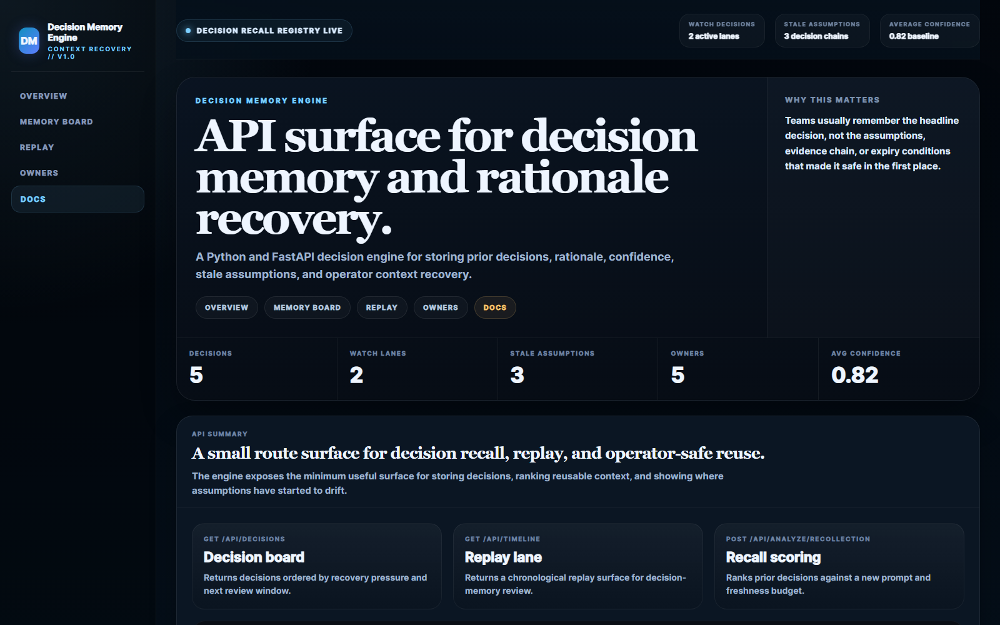
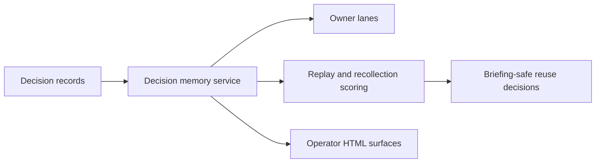

# Decision Memory Engine

Python and FastAPI decision-intelligence service for **storing prior decisions, rationale, confidence, stale assumptions, and operator context recovery**.

> **What this repo proves**
>
> Teams make better follow-on decisions when they can recover the original rationale chain instead of only inheriting the headline outcome.

## Why this repo exists

Organizations often remember what was decided but lose the more valuable parts:

- which assumptions made the decision safe
- which sources supported the decision
- when the reasoning should be reviewed again
- what changed after the decision was made

`decision-memory-engine` turns those decision artifacts into reusable memory
records. It helps teams decide whether an old decision is still safe to reuse in
a new board, product, risk, or operator context.

## Screenshots

### Overview



### Memory Board



### Replay



### API Summary



## What it includes

- FastAPI service for decision memory and context replay
- sample decisions across revenue, risk, platform, real estate, and education lanes
- rationale, stale-signal, and next-review tracking
- owner-lane and replay surfaces
- HTML proof scenes and PNG screenshots generated from the repo
- tests, docs, changelog, and CI

## Local run

```powershell
cd decision-memory-engine
py -3.11 -m venv .venv
.\.venv\Scripts\python.exe -m pip install -r requirements.txt
.\.venv\Scripts\python.exe -m app.main
```

Open:

- [http://127.0.0.1:5006/](http://127.0.0.1:5006/)
- [http://127.0.0.1:5006/memory-board](http://127.0.0.1:5006/memory-board)
- [http://127.0.0.1:5006/replay](http://127.0.0.1:5006/replay)
- [http://127.0.0.1:5006/owners](http://127.0.0.1:5006/owners)
- [http://127.0.0.1:5006/docs](http://127.0.0.1:5006/docs)

If that port is occupied:

```powershell
$env:PORT = "5010"
.\.venv\Scripts\python.exe -m app.main
```

## Validation

```powershell
cd decision-memory-engine
.\.venv\Scripts\python.exe -m unittest discover -s tests
.\.venv\Scripts\python.exe scripts\run_demo.py
.\.venv\Scripts\python.exe scripts\smoke_check.py
.\.venv\Scripts\python.exe scripts\render_readme_assets.py
```

## API routes

- `GET /api/dashboard/summary`
- `GET /api/decisions`
- `GET /api/decisions/{decision_id}`
- `GET /api/timeline`
- `GET /api/owners`
- `GET /api/sample`
- `POST /api/analyze/recollection`

## Architecture



More detail lives in [docs/architecture.md](./docs/architecture.md).
